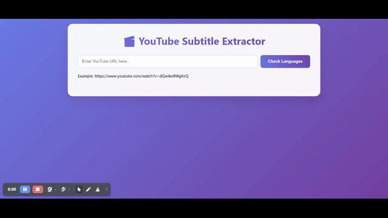

# YouTube Subtitle Extractor

A full-stack Flask application that extracts subtitles from YouTube videos and generates key points using AI models.

## Preview



## Features

- 🎬 Extract subtitles from any YouTube video with available transcripts
- 🌐 **Language Selection**: Choose from available subtitle languages with detailed information
- 🔍 **Language Detection**: Automatically detect all available subtitle languages
- 🏷️ **Language Info**: Shows auto-generated vs manual subtitles and translatability
- 🧠 **AI-Powered Key Points**: Generate key insights using Groq API with multiple AI models
- 🎨 Modern, responsive web interface with glassmorphism design
- 📋 Copy transcript and key points to clipboard
- 🔄 Real-time loading indicators with smooth animations
- 📱 Fully responsive design for all devices
- 🚀 RESTful API endpoints

## AI Models Available

- **Llama 4 Scout 17B**: Faster processing for quick key point generation
- **Llama 3.3 70B**: More accurate analysis for detailed insights

## Setup Instructions

### 1. Install Dependencies

```bash
pip install -r requirements.txt
```

Or install manually:
```bash
pip install Flask youtube-transcript-api python-dotenv requests
```

### 2. Environment Setup

Create a `.env` file in the project root:
```env
GROQ_API_KEY=your_groq_api_key_here
```

Get your Groq API key from: https://console.groq.com/

### 3. Project Structure

Create the following directory structure:
```
youtube-subtitle-extractor/
├── app.py
├── requirements.txt
├── .env
├── templates/
│   └── index.html
└── static/ (auto-created)
```

### 4. Run the Application

```bash
python app.py
```

The application will be available at: `http://localhost:5000`

## Usage

### Web Interface
1. Open your browser and go to `http://localhost:5000`
2. Enter a YouTube URL in the input field
3. Click "Check Languages" to see available subtitle languages
4. Select your preferred language from the grid of options
5. Click "Extract Subtitles" to get the transcript
6. Choose an AI model and click "Generate Key Points" for AI-powered insights
7. Copy transcript or key points to clipboard as needed

### API Endpoints

#### Get Available Languages
**POST** `/api/languages`

Request body:
```json
{
    "url": "https://www.youtube.com/watch?v=VIDEO_ID"
}
```

Response:
```json
{
    "video_id": "VIDEO_ID",
    "languages": [
        {
            "language_code": "en",
            "language": "English",
            "is_generated": true,
            "is_translatable": true
        }
    ],
    "success": true
}
```

#### Extract Transcript
**POST** `/api/transcript`

Request body:
```json
{
    "url": "https://www.youtube.com/watch?v=VIDEO_ID",
    "language_code": "en"
}
```

Response:
```json
{
    "video_id": "VIDEO_ID",
    "transcript": "Full transcript text...",
    "language_code": "en",
    "success": true
}
```

#### Generate Key Points
**POST** `/api/keypoints`

Request body:
```json
{
    "transcript": "Full transcript text...",
    "model": "meta-llama/llama-4-scout-17b-16e-instruct"
}
```

Response:
```json
{
    "key_points": "Generated key points...",
    "model": "meta-llama/llama-4-scout-17b-16e-instruct",
    "success": true
}
```

#### Health Check
**GET** `/api/health`

Response:
```json
{
    "status": "healthy"
}
```

## Supported URL Formats

- `https://www.youtube.com/watch?v=VIDEO_ID`
- `https://youtu.be/VIDEO_ID`
- `https://www.youtube.com/embed/VIDEO_ID`
- `https://www.youtube.com/watch?v=VIDEO_ID&other_params`

## Language Selection Features

- **Visual Language Grid**: Interactive grid showing all available languages
- **Language Metadata**: 
  - Auto-generated vs manual subtitles
  - Translatable indicators
  - Language codes and full names
- **Smart Selection**: Radio button selection with visual feedback
- **Fallback Support**: Automatic fallback to default language if selected language fails

## AI-Powered Key Points

The application integrates with Groq API to generate intelligent key points:

- **Multiple Models**: Choose between speed (Llama 4 Scout) and accuracy (Llama 3.3 70B)
- **Formatted Output**: AI-generated points are formatted with proper HTML rendering
- **Indonesian Support**: Prompts in Indonesian for localized key point generation
- **Error Handling**: Robust error handling for API failures

## UI/UX Features

- **Glassmorphism Design**: Modern glass-like aesthetic with backdrop blur
- **Smooth Animations**: Loading spinners, hover effects, and transitions
- **Interactive Elements**: Copy buttons with success/error notifications
- **SweetAlert2 Integration**: Beautiful toast notifications for user feedback
- **Responsive Layout**: Works seamlessly on desktop, tablet, and mobile
- **Color-Coded Sections**: Different color schemes for transcript vs key points

## Error Handling

Comprehensive error handling for:
- Invalid YouTube URLs
- Videos without available transcripts
- Selected language not available
- Private or restricted videos
- Network errors
- Groq API failures
- Malformed requests
- Invalid AI model selection

## Requirements

### Python Dependencies
```
Flask>=2.0.0
youtube-transcript-api>=0.5.0
python-dotenv>=0.19.0
requests>=2.28.0
```

### External Services
- **Groq API**: For AI-powered key point generation
- **YouTube**: For video transcript extraction

## Notes

- Only works with videos that have available transcripts/subtitles
- Supports both manual and auto-generated subtitles
- AI key point generation requires valid Groq API key
- Indonesian language prompts are used for key point generation
- The transcript is returned as plain text without timestamps
- Key points are formatted with HTML for better presentation
- All data is processed in-memory (no persistent storage)

## Contributing

Feel free to submit issues and enhancement requests!

## License

This project is open source and available under the MIT License.
